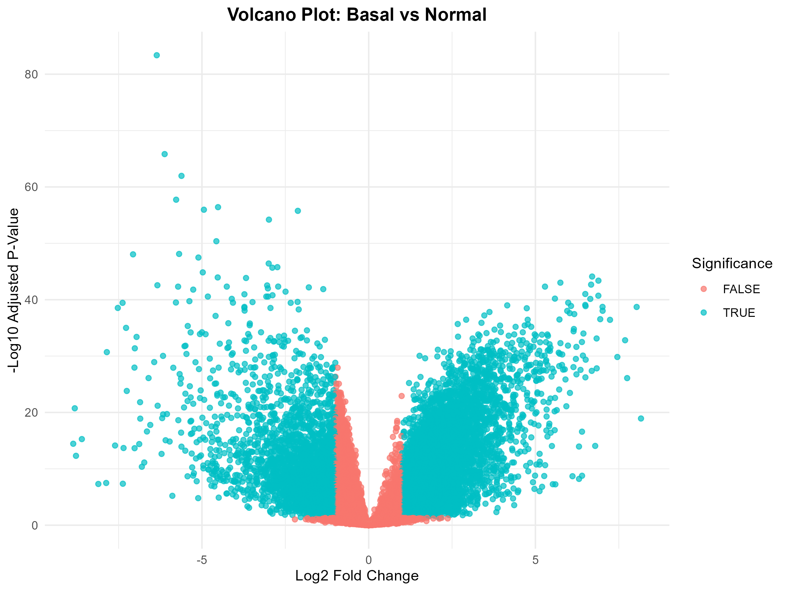
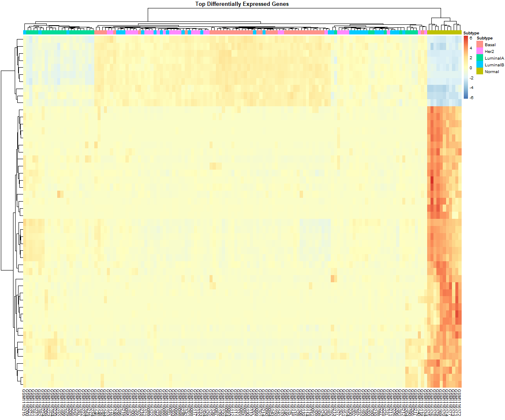

# Basal Breast Cancer Transcriptomic Analysis

Differential gene expression analysis of basal breast cancer using GEO microarray data and the limma package in R.

## Overview

This project explores transcriptomic differences between basal breast tumors and normal breast tissue using publicly available microarray data from the Gene Expression Omnibus (GEO).

The goal was to identify genes that are significantly differentially expressed in basal breast cancer and to visualize these patterns using standard bioinformatics approaches.

## Dataset

**GEO Accession:** GSE45827

**Platform:** Affymetrix Human Genome U133 Plus 2.0 Array

## Sample Groups:

- Basal tumors
- HER2 tumors
- Luminal A tumors
- Luminal B tumors
- Normal breast tissue

**Data Source:**  NCBI Gene Expression Omnibus (GEO)

## Methods:

- Downloaded expression data using GEOquery.
- Extracted expression and phenotype information.
- Classified samples according to tumor subtype.
- Compared basal breast tumors with normal breast tissue.
- Performed differential expression analysis using the limma framework.
- Applied False Discovery Rate (FDR) correction for multiple testing.

## Defined significant genes using:
- Adjusted P-value < 0.05
- Absolute log2 fold change > 1

## Generated volcano plot and heatmap visualizations.

## Results

## Volcano Plot



### Heatmap



## Key Findings:

- Identified genes significantly associated with basal breast cancer.
- Visualized differential expression patterns using a volcano plot.
- Generated a heatmap of the top differentially expressed genes.
- Exported complete and filtered results for downstream analyses.

## Repository Structure

```text
data/
figures/
outputs/
scripts/
README.md
```

## Future Directions

Potential extensions of this project include:

- Gene Ontology (GO) enrichment analysis
- KEGG pathway analysis
- Validation using independent datasets
- RNA-seq based differential expression analysis
- Integration with clinical outcome data
